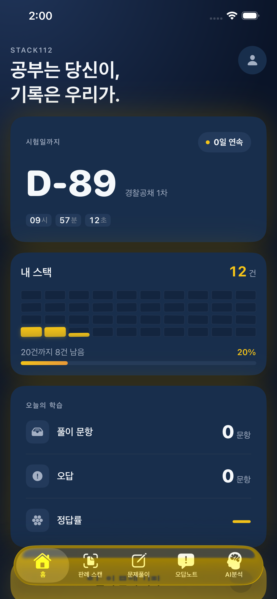
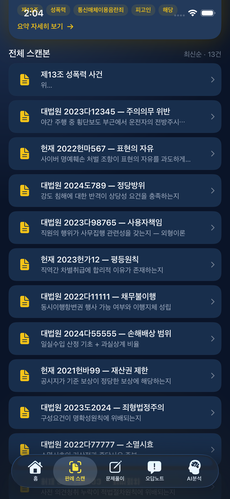
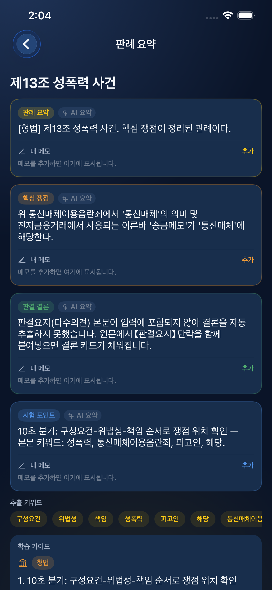
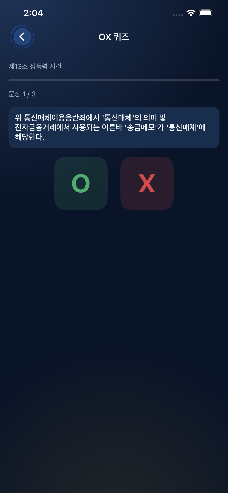
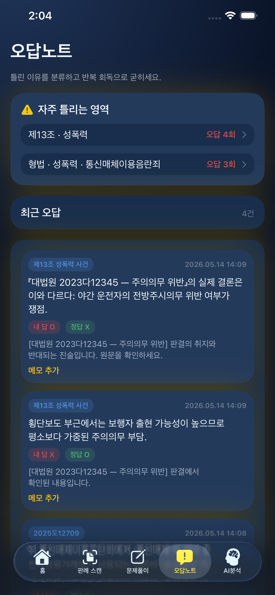
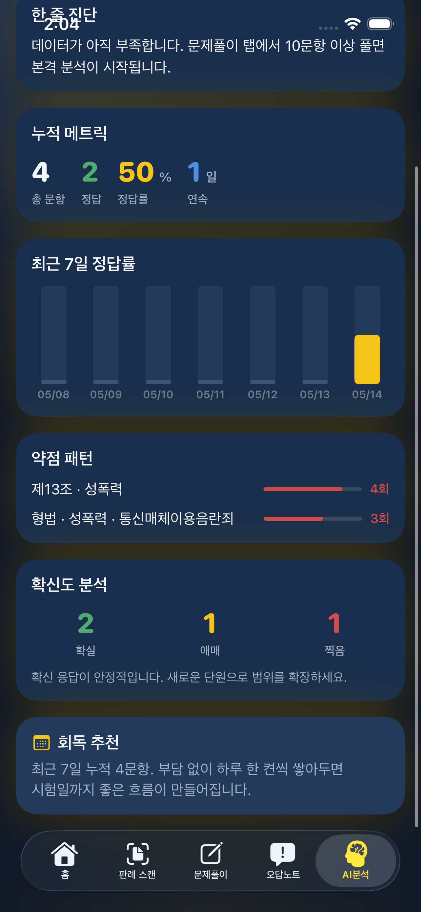
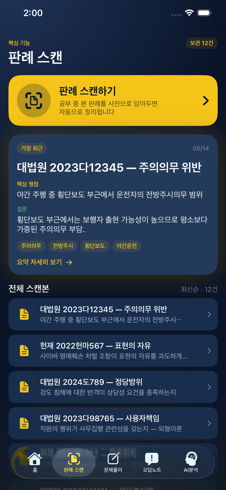
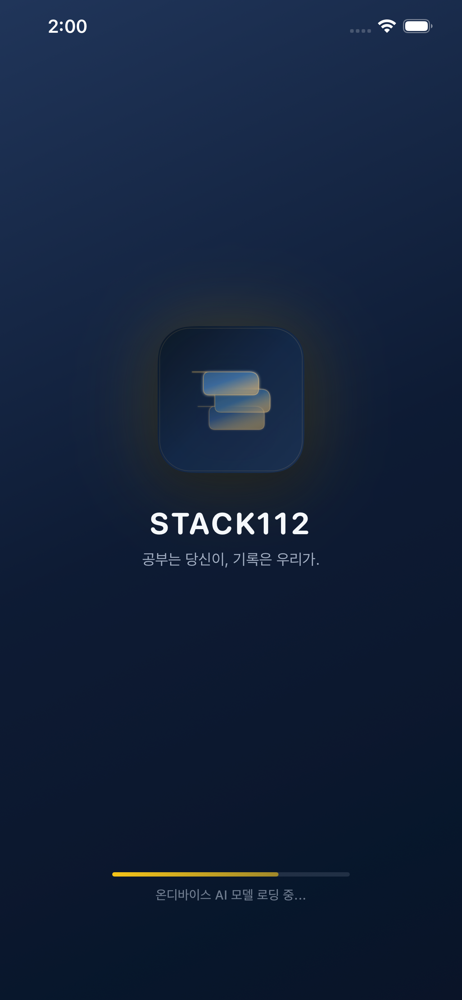

# STACK112 프로젝트 문서 허브

> 안내: 본 문서는 기획 문서와 현재 구현 상태를 함께 관리하는 기준 문서입니다.

## 앱 다운로드

- App Store 링크: https://apps.apple.com/kr/app/stack112/id6768943423
- 배포 완료 및 iPhone/iPad에서 바로 다운로드 가능합니다.

문서 최신화: 2026-05-19 (앱 화면 미리보기 섹션 반영)

## 최종 제출 체크리스트 (온디바이스 기준)

- 공개 저장소 필수 문서
	- README: `README.md`
	- CONTRIBUTING: `CONTRIBUTING.md`
	- CODE OF CONDUCT: `CODE_OF_CONDUCT.md`
	- LICENSE: `LICENSE`
- 동작 가능한 AI 기능(UI)
	- 완전 온디바이스 동작 개요: `code/ios/README.md`
	- 핵심 구현: `code/ios/AISYSApp/Sources/LLMService.swift`
- PR 게이트 CI/CD
	- 린트/테스트: `.github/workflows/ci.yml`
	- 보안 스캔: `.github/workflows/code-check.yml`
	- iOS 빌드/테스트: `.github/workflows/ios-ci.yml`
- main 배포/헬스체크/롤백/관측성
	- main 배포 파이프라인: `.github/workflows/main-release-ondevice.yml`
	- 운영 런북: `docs/operations/ONDEVICE_RUNBOOK.md`
	- 관측성: `docs/operations/OBSERVABILITY.md`
- 테스트/보안/문서 요건
	- 테스트: `code/ios/AISYSAppTests/AISYSAppTests.swift`
	- 보안(Dependabot): `.github/dependabot.yml`
	- 문서(ADR): `docs/adr/README.md`
	- 추가 문서: `docs/model/MODEL_CARD.md`, `CHANGELOG.md`
- 릴리스/회고/데모
	- 릴리스 태그: `v1.0.0` 이상
	- 회고: `RETROSPECTIVE.md`
	- 영상 데모 가이드/링크: `docs/demo/DEMO_VIDEO.md`
	- 저장소 내 데모 영상: `assets/demo/stack112-demo-2026-06-19.mov`

## 리포지토리 구조 (Quick Map)

- `docs/`: 기획/아키텍처/ADR/API/트러블슈팅/회의노트/온보딩 문서 허브
- `docs/project/`: PRD, 로드맵, 발표 자료 등 프로젝트 산출물
- `docs/roles/`: 역할별 실행 가이드
- `docs/governance/`: Discussions/Wiki/문서 운영 정책
- `docs/rfc/`: 변경 합의(RFC) 문서와 템플릿
- `assets/images/`: 테스트/시뮬레이터 등 이미지 자산
- `code/`: 실제 구현 코드(backend, ios, data, db)
- `scripts/`: 실험/보조 스크립트

## 현재 구현 상태 (2026-05-14)
- iOS 앱(탭 5개: Home/OCR/Search/Review/My Page)이 **완전 온디바이스(Backend-free)** 모드로 동작합니다.
- 모든 검색·IR 추출·유사 판례·요약·OX 퀴즈는 단말 내부에서 실행되며, 서버/네트워크 없이도 풀 기능 사용 가능합니다.
- 핵심 모듈: `LegalAnalyzer` (도메인 분류 + 함정 카탈로그 + 개인화), `LegalIssueDictionary`, `LocalIRPipeline`, `LocalCaseSearchEngine`, `LocalCaseStore`, `LocalSimilarityEngine`(`NLEmbedding`).
- 온디바이스 LLM은 LlamaSwift(llama.cpp) + Llama-3.2-1B-Instruct-Q4_K_M.gguf (807MB) 를 `.app` 번들에 포함합니다. 최종 앱 크기 783MB.
- LLM 호출에 응답 캐시(summary/OX/RAG dict, 32 capacity), OX 동적 토큰(`min(360, 100+70*count)`), 부분 수락+폴백 보충 적용.
- 도메인 전용 프롬프트 + 함정 카탈로그(5도메인×8~14패턴, 매 호출 셔플) + 약점 키워드 주입(`weakKeywordsProvider`)으로 개인화 학습.
- 복습 노트 "자주 틀리는 영역" 카드 → `WeakOXListView` (오답 OX 모음).
- 운영: HTTP 백엔드 의존 0, EC2/RDS 비용 0, App Privacy "Data Not Collected" 신고 가능.
- App Store 배포 완료: [STACK112 다운로드](https://apps.apple.com/kr/app/stack112/id6768943423)
- App Store 제출 반영: ITSAppUsesNonExemptEncryption=NO, LSSupportsOpeningDocumentsInPlace=NO, DEBUG-gated 서버 UI, 1024×1024 AppIcon (RGB no-alpha), Privacy Policy URL 게시 (https://acertainromance401.github.io/stack112-privacy/), App Review 제출 완료.
- 최신 점검: iPhone 12 mini(A14, 4GB) 실기기에서 OCR → 분류 → 요약 → OX → 검색 → 복습 전체 흐름 정상 동작 확인, Release 설치/Archive/ASC 업로드 검증 완료.

## 앱 화면 미리보기

출처: `code/ios/appstore_screenshots/` (App Store 제출 선별본)

| 홈 | 스캔 라이브러리 | AI 요약 | OX 퀴즈 |
|---|---|---|---|
|  |  |  |  |

| 오답 노트 | AI 분석 | 사건 스캔 진입 | 스플래시 |
|---|---|---|---|
|  |  |  |  |

## 관련 문서
- [docs/README.md](docs/README.md) — 비동기 협업용 문서 허브(ADR/아키텍처/API/트러블슈팅/회의노트/온보딩)
- [docs/governance/DISCUSSIONS_AND_WIKI.md](docs/governance/DISCUSSIONS_AND_WIKI.md) — Discussions/Wiki 운영 기준
- [docs/rfc/README.md](docs/rfc/README.md) — RFC 프로세스와 템플릿
- [docs/wiki/README.md](docs/wiki/README.md) — GitHub Wiki 업로드 번들 가이드
- [docs/project/Project_Status_and_Roadmap_2026-05-12.md](docs/project/Project_Status_and_Roadmap_2026-05-12.md) — 2026-05-14 제출 상태까지 반영
- [docs/project/Project_Status_and_Roadmap_2026-05-11.md](docs/project/Project_Status_and_Roadmap_2026-05-11.md)
- [docs/project/Project_Status_and_Roadmap_2026-05-10.md](docs/project/Project_Status_and_Roadmap_2026-05-10.md)
- [docs/project/Project_Description.md](docs/project/Project_Description.md)
- [docs/project/User_Journey_Scenario_AI_SYS.md](docs/project/User_Journey_Scenario_AI_SYS.md)
- [docs/project/PRD_AI_SYS.md](docs/project/PRD_AI_SYS.md)
- [docs/project/WBS_AI_SYS.md](docs/project/WBS_AI_SYS.md)
- [docs/project/Wireframe_AI_SYS.md](docs/project/Wireframe_AI_SYS.md)
- [docs/project/Screen_Flow_AI_SYS.md](docs/project/Screen_Flow_AI_SYS.md)
- [docs/project/Technology_Stack_AI_SYS.md](docs/project/Technology_Stack_AI_SYS.md)
- [docs/project/Project_Description_Progress_2026-04-16.md](docs/project/Project_Description_Progress_2026-04-16.md)
- [code/Data_Build_Guide_AI_SYS.md](code/Data_Build_Guide_AI_SYS.md)
- [code/Run_Guide_AI_SYS.md](code/Run_Guide_AI_SYS.md)
- [code/db/schema.sql](code/db/schema.sql)
- [code/data/README.md](code/data/README.md)
- [code/backend/README.md](code/backend/README.md)
- [docker-compose.yml](docker-compose.yml)
- [code/backend/Dockerfile](code/backend/Dockerfile)

## 전체 문서 바로가기 (링크 + 설명)

아래 목록은 저장소 내 Markdown 문서를 종류별로 구분한 인덱스입니다.

### 루트/공통 문서
- [README.md](README.md) — 프로젝트 메인 허브 문서
- [CHANGELOG.md](CHANGELOG.md) — 버전별 변경 이력 문서
- [CODE_OF_CONDUCT.md](CODE_OF_CONDUCT.md) — 프로젝트 행동 강령 문서
- [CONTRIBUTING.md](CONTRIBUTING.md) — 협업 및 기여 가이드
- [RETROSPECTIVE.md](RETROSPECTIVE.md) — 프로젝트 회고 문서
- [assets/README.md](assets/README.md) — assets 디렉터리의 사용/구성 안내 문서

### GitHub 협업 템플릿
- [.github/ISSUE_TEMPLATE/bug_report.md](.github/ISSUE_TEMPLATE/bug_report.md) — 버그 제보 이슈 템플릿 문서
- [.github/ISSUE_TEMPLATE/feature_request.md](.github/ISSUE_TEMPLATE/feature_request.md) — 기능 제안 이슈 템플릿 문서
- [.github/pull_request_template.md](.github/pull_request_template.md) — PR 작성 시 체크해야 할 항목 템플릿

### 운영/배포/실행 가이드
- [code/ARCHITECTURE_AND_DEPLOYMENT.md](code/ARCHITECTURE_AND_DEPLOYMENT.md) — AI_SYS 아키텍처/파이프라인/배포 통합 가이드
- [code/AWS_FREE_TIER_DEPLOYMENT.md](code/AWS_FREE_TIER_DEPLOYMENT.md) — AWS Free Tier 배포 가이드
- [code/PRODUCTION_DEPLOYMENT_GUIDE.md](code/PRODUCTION_DEPLOYMENT_GUIDE.md) — 프로덕션 배포 가이드
- [code/Run_Guide_AI_SYS.md](code/Run_Guide_AI_SYS.md) — 실행/구동 가이드
- [docs/operations/ONDEVICE_RUNBOOK.md](docs/operations/ONDEVICE_RUNBOOK.md) — 온디바이스 운영 런북
- [docs/operations/OBSERVABILITY.md](docs/operations/OBSERVABILITY.md) — 관측성(로그/메트릭/점검) 운영 문서

### 데이터 문서
- [code/Data_Build_Guide_AI_SYS.md](code/Data_Build_Guide_AI_SYS.md) — 데이터 구축 가이드
- [code/data/README.md](code/data/README.md) — 데이터 폴더 표준 및 규칙 안내
- [code/data/policy/SCourt_Policy_Check_Guide.md](code/data/policy/SCourt_Policy_Check_Guide.md) — SCourt 정책 점검 가이드
- [code/data/templates/scourt_permission_request_email.md](code/data/templates/scourt_permission_request_email.md) — SCourt 수집 허용 문의 메일 템플릿

### Backend/Android/iOS 문서
- [code/backend/README.md](code/backend/README.md) — Backend 빠른 시작 가이드
- [code/android/README.md](code/android/README.md) — Android 앱 구조/실행 안내
- [code/android/FEATURE_PARITY_CHECKLIST.md](code/android/FEATURE_PARITY_CHECKLIST.md) — Android 기능 동등성 체크리스트
- [code/android/DOC_TEMPLATE_KO.md](code/android/DOC_TEMPLATE_KO.md) — Android 문서 작성 템플릿
- [code/ios/README.md](code/ios/README.md) — iOS 앱 구조/빌드/실행 안내
- [code/ios/APPSTORE_UPDATES_GUIDE.md](code/APPSTORE_UPDATES_GUIDE.md) — iOS 앱스토어 승인 후 업데이트 가이드
- [code/ios/APPSTORE_METADATA.md](code/ios/APPSTORE_METADATA.md) — App Store 등록 메타데이터 문서
- [code/ios/APPSTORE_PRIVACY_NUTRITION.md](code/ios/APPSTORE_PRIVACY_NUTRITION.md) — App Privacy 응답지 문서
- [code/ios/PRIVACY_POLICY.md](code/ios/PRIVACY_POLICY.md) — 개인정보처리방침 문서
- [code/ios/SCREENSHOT_GUIDE.md](code/ios/SCREENSHOT_GUIDE.md) — App Store 스크린샷 캡처 가이드
- [code/ios/AISYSApp/Resources/Assets.xcassets/AppIcon.appiconset/README.md](code/ios/AISYSApp/Resources/Assets.xcassets/AppIcon.appiconset/README.md) — AppIcon 자리표시자 안내 문서

### Docs 허브 인덱스
- [docs/README.md](docs/README.md) — 문서 허브 인덱스
- [docs/api/README.md](docs/api/README.md) — API 명세 인덱스
- [docs/architecture/README.md](docs/architecture/README.md) — 아키텍처 문서 안내
- [docs/onboarding/FAQ_ONBOARDING.md](docs/onboarding/FAQ_ONBOARDING.md) — 온보딩 FAQ
- [docs/meeting-notes/README.md](docs/meeting-notes/README.md) — 회의록 운영/보관 안내
- [docs/troubleshooting/README.md](docs/troubleshooting/README.md) — 트러블슈팅 가이드
- [docs/demo/DEMO_VIDEO.md](docs/demo/DEMO_VIDEO.md) — 데모 영상 제작/제출 가이드
- [assets/demo/stack112-demo-2026-06-19.mov](assets/demo/stack112-demo-2026-06-19.mov) — 제출용 데모 영상 파일
- [docs/model/MODEL_CARD.md](docs/model/MODEL_CARD.md) — 온디바이스 모델 카드

### ADR/RFC/거버넌스 문서
- [docs/adr/README.md](docs/adr/README.md) — ADR 운영 안내
- [docs/adr/template.md](docs/adr/template.md) — ADR 작성 템플릿
- [docs/adr/0001-ondevice-first.md](docs/adr/0001-ondevice-first.md) — On-device First 아키텍처 의사결정 기록
- [docs/adr/0002-governance-docs-baseline.md](docs/adr/0002-governance-docs-baseline.md) — 거버넌스 문서 체계 표준화 의사결정 기록
- [docs/rfc/README.md](docs/rfc/README.md) — RFC 프로세스 안내
- [docs/rfc/template.md](docs/rfc/template.md) — RFC 작성 템플릿
- [docs/rfc/0001-discussions-wiki-rollout.md](docs/rfc/0001-discussions-wiki-rollout.md) — Discussions/Wiki 롤아웃 RFC
- [docs/governance/DISCUSSIONS_AND_WIKI.md](docs/governance/DISCUSSIONS_AND_WIKI.md) — Discussions/Wiki 운영 기준

### 프로젝트 기획/로드맵 문서
- [docs/project/README.md](docs/project/README.md) — 프로젝트 기획 문서 모음 인덱스
- [docs/project/PRD_AI_SYS.md](docs/project/PRD_AI_SYS.md) — 제품 요구사항 문서(PRD)
- [docs/project/Project_Description.md](docs/project/Project_Description.md) — 프로젝트 설명서
- [docs/project/Project_Description_Progress_2026-04-16.md](docs/project/Project_Description_Progress_2026-04-16.md) — 프로젝트 진행상황 상세 보고서
- [docs/project/Project_Status_and_Roadmap_2026-04-23.md](docs/project/Project_Status_and_Roadmap_2026-04-23.md) — 진행 현황 및 로드맵(2026-04-23)
- [docs/project/Project_Status_and_Roadmap_2026-05-10.md](docs/project/Project_Status_and_Roadmap_2026-05-10.md) — 진행 현황 및 로드맵(2026-05-10)
- [docs/project/Project_Status_and_Roadmap_2026-05-11.md](docs/project/Project_Status_and_Roadmap_2026-05-11.md) — 진행 현황 및 로드맵(2026-05-11)
- [docs/project/Project_Status_and_Roadmap_2026-05-12.md](docs/project/Project_Status_and_Roadmap_2026-05-12.md) — 진행 현황 및 로드맵(2026-05-12)
- [docs/project/Technology_Stack_AI_SYS.md](docs/project/Technology_Stack_AI_SYS.md) — 기술 스택 설명 문서
- [docs/project/User_Journey_Scenario_AI_SYS.md](docs/project/User_Journey_Scenario_AI_SYS.md) — 사용자 여정 시나리오 문서
- [docs/project/Screen_Flow_AI_SYS.md](docs/project/Screen_Flow_AI_SYS.md) — 화면 흐름도 문서
- [docs/project/Wireframe_AI_SYS.md](docs/project/Wireframe_AI_SYS.md) — 와이어프레임 문서
- [docs/project/WBS_AI_SYS.md](docs/project/WBS_AI_SYS.md) — WBS 문서
- [docs/project/UX_UI_Redesign_2026-05-11.md](docs/project/UX_UI_Redesign_2026-05-11.md) — UX/UI 개편 명세 문서
- [docs/project/LLM_Hybrid_Contract_AI_SYS.md](docs/project/LLM_Hybrid_Contract_AI_SYS.md) — LLM 하이브리드 계약(입출력/제약) 문서

### 역할/연구 문서
- [docs/roles/Role_Configuration.md](docs/roles/Role_Configuration.md) — 역할 구성 표준 문서
- [docs/roles/1_Backend.md](docs/roles/1_Backend.md) — 백엔드 역할/업무 가이드
- [docs/roles/2_Frontend.md](docs/roles/2_Frontend.md) — 프론트엔드 역할/업무 가이드
- [docs/roles/3_AI_Model_Design.md](docs/roles/3_AI_Model_Design.md) — AI 모델 설계 역할/업무 가이드
- [docs/roles/4_Data_Management.md](docs/roles/4_Data_Management.md) — 데이터 관리 역할/업무 가이드
- [docs/research/OPTIMIZATION_COMPLETE.md](docs/research/OPTIMIZATION_COMPLETE.md) — iOS 최적화 결과 문서
- [docs/research/police_exam_classification_tree.md](docs/research/police_exam_classification_tree.md) — 경찰 시험 분류 트리 정리 문서
- [docs/research/User_Evaluation_Report.md](docs/research/User_Evaluation_Report.md) — 사용자 평가 보고서
- [docs/research/User_Evaluation_Report.md](docs/research/User_Evaluation_Report.md) — 사용자 평가 보고서

### Wiki 원본/배포 번들 문서
- [docs/wiki/README.md](docs/wiki/README.md) — Wiki 번들 구성/업로드 가이드
- [docs/wiki/HOME.md](docs/wiki/HOME.md) — Wiki 홈 초안 문서
- [docs/wiki/pages/Home.md](docs/wiki/pages/Home.md) — Wiki 홈 페이지 문서
- [docs/wiki/pages/Getting-Started.md](docs/wiki/pages/Getting-Started.md) — Wiki용 시작 가이드
- [docs/wiki/pages/Architecture.md](docs/wiki/pages/Architecture.md) — Wiki용 아키텍처 문서
- [docs/wiki/pages/API-Guide.md](docs/wiki/pages/API-Guide.md) — Wiki용 API 가이드
- [docs/wiki/pages/ADR-Index.md](docs/wiki/pages/ADR-Index.md) — Wiki용 ADR 인덱스
- [docs/wiki/pages/RFC-Index.md](docs/wiki/pages/RFC-Index.md) — Wiki용 RFC 인덱스
- [docs/wiki/pages/Troubleshooting.md](docs/wiki/pages/Troubleshooting.md) — Wiki용 트러블슈팅 문서
- [docs/wiki/wiki-bundle/Home.md](docs/wiki/wiki-bundle/Home.md) — 배포 번들용 홈 문서
- [docs/wiki/wiki-bundle/Getting-Started.md](docs/wiki/wiki-bundle/Getting-Started.md) — 배포 번들용 시작 가이드
- [docs/wiki/wiki-bundle/Architecture.md](docs/wiki/wiki-bundle/Architecture.md) — 배포 번들용 아키텍처 문서
- [docs/wiki/wiki-bundle/API-Guide.md](docs/wiki/wiki-bundle/API-Guide.md) — 배포 번들용 API 가이드
- [docs/wiki/wiki-bundle/ADR-Index.md](docs/wiki/wiki-bundle/ADR-Index.md) — 배포 번들용 ADR 인덱스
- [docs/wiki/wiki-bundle/RFC-Index.md](docs/wiki/wiki-bundle/RFC-Index.md) — 배포 번들용 RFC 인덱스
- [docs/wiki/wiki-bundle/Troubleshooting.md](docs/wiki/wiki-bundle/Troubleshooting.md) — 배포 번들용 트러블슈팅 문서

## 1. 팀 소개
- 팀 이름: 까짓것 돌려보조
- 팀원 역할
  -조장: 임재현
  -발표: 홍여진
  -(주력)개발 및 자료조사: 서준희, 이지현
  

## 2. 문제 정의
- 어떤 문제를 해결하려 하는가
	- 경찰 공무원 시험 준비 과정에서 필요한 판례를 찾고 확인하는 데 시간이 과도하게 소요되는 문제를 해결하고자 함.
	- 일반 LLM 사용 시 근거 없는 답변이나 부정확한 판례 인용이 발생할 수 있어, 학습 신뢰도를 저해하는 할루시네이션 문제를 줄이고자 함.
- 왜 중요한 문제인가, 문제의 배경
	- 실제 시험 준비생 인터뷰에서 판례 확인을 위해 검색 사이트와 자료집을 반복적으로 오가며 학습 흐름이 끊긴다는 의견이 확인됨.
	- 판례 기반 과목은 최신성, 정확성, 맥락 이해가 핵심이므로, 탐색 시간 단축과 정보 정확도 개선은 학습 효율과 성적 향상에 직접적인 영향을 줌.
- (중요) 문제를 "한 문장"으로 정의
	- 판례 기반 시험 준비에서 검색 소요 시간을 줄이고 정확한 근거 중심 학습을 가능하게 하는 시스템이 필요함.

## 3. 대상 사용자
- 누가 이 시스템을 사용하는가
	- 타겟 고객층(좁은 범위): 행정학과, 경찰학과 등 법 기반 학습이 필요한 대학생
	- 타겟 고객층(넓은 범위): 법과 판례를 활용하는 국가고시 준비생 및 실무 시험 대비 학습자
- 사용 시나리오
	- 사용자는 문제 풀이 중 모르는 판례가 나오면 키워드 또는 사건명을 입력해 관련 판례를 즉시 조회함.
	- 시스템은 판례 요약, 핵심 쟁점, 시험 포인트를 함께 제시하고, 유사 기출 문항과 연결해 복습 동선을 제공함.
	- 사용자는 학습 세션 종료 후 자주 틀린 판례/쟁점 목록을 확인해 취약 영역을 반복 학습함.

## 4. 기존 서비스 분석
- 현재 존재하는 경쟁 서비스
	- 빅케이스
	- 헌법 GPT
- 기본 서비스 한계점
	1. 빅케이스: 판결문 검색과 요약 기능은 우수하나, 수험생 관점의 문제 풀이 연계(기출 연결, 오답 기반 추천, 시험형 피드백)가 제한적임.
	2. 헌법 GPT: 헌법 중심 활용에는 강점이 있으나, 경찰 시험 준비에서 요구되는 최신 판례 반영과 과목별 맥락 대응 측면에서 한계가 있음.

## 5. 제안하는 AI 시스템 아이디어
- 어떤 AI 시스템인가 (한 문장으로 정의)
	- 판례를 이용한 AI 경찰 고시 학습 플랫폼
- 핵심 기능, 사용하고자 하는 기술 및 AI 모델 등
	- 핵심 기능
		- 판례 검색 및 요약: 키워드/사건명 기반으로 관련 판례를 빠르게 조회하고 핵심 쟁점, 결론, 시험 포인트를 요약 제공.
		- 문제 풀이 연계: 판례와 연결된 기출/예상 문제를 함께 제시하여 학습-적용-복습 흐름을 구성.
		- 근거 제시 응답: 답변 시 참조한 판례 출처를 함께 제시하여 학습 신뢰도를 확보.
		- 오답 기반 개인화 복습: 사용자의 오답 이력과 취약 쟁점을 기반으로 반복 학습 목록 자동 추천.
	- 사용 기술
		- RAG(Retrieval-Augmented Generation) 기반 질의응답 구조를 적용하여 최신 판례 검색 결과를 우선 반영.
		- 벡터 데이터베이스를 활용한 유사 판례 검색 및 재순위화(reranking)로 정확도 향상.
		- 웹 서비스 형태의 학습 대시보드(검색, 요약, 오답노트, 복습 스케줄) 제공.
	- AI 모델
		- 한국어 이해/요약 성능이 우수한 LLM을 기본 생성 모델로 사용.
		- 임베딩 모델을 통해 판례 문서 벡터화 및 유사도 검색 수행.
		- 필요 시 도메인 튜닝 또는 프롬프트 최적화를 통해 법학/수험 문맥 응답 품질 개선.

## 6. 기대효과
- 이 시스템을 이용하면 어떤 변화가 생기는가
	- 판례 탐색 및 정리 시간을 단축하여 학습 시간을 문제 풀이와 약점 보완에 더 집중할 수 있음. 검색했던 판례 적재 후 추후 복습 기능으로 재사용.
	- 근거 기반 답변을 통해 할루시네이션 위험을 줄이고, 수험생의 학습 신뢰도와 의사결정 정확도를 높일 수 있음.
	- 오답 기반 복습 루틴으로 개인별 취약 쟁점 개선 속도를 높여 성과 중심 학습이 가능해짐.
	- 결과적으로 학습 효율성과 시험 대비 완성도를 동시에 향상할 수 있음.

## 7. 개발 일정 및 역할 분담
- 개발 일정 (15주 수업 일정 기준)

| 주차 | 단계 | 상세 내용 |
|------|------|-----------|
| 4~6주차 | 팀 확정 및 기획 고도화 | - 최종 팀 구성 확정 및 역할(PM·AI·백엔드·프론트·QA) 분배 - 비전공자 사용자 인터뷰 설계: 경찰학과·행정학과 학생 대상 학습 흐름 및 판례 탐색 어려움 파악 - 인터뷰 결과 분석 → 판례 검색·요약·기출 연계·오답 복습 4개 핵심 기능 우선순위 확정 - 경찰 고시 준비생 대상 학습 Pain Point(판례 탐색 비효율, LLM 할루시네이션 문제) 사전 조사 - 판례 기반 AI 학습 플랫폼 방향 초안 정의 - 아이디어 발표 및 동료·교수 피드백 수렴 - 서비스 화면 흐름도(검색→요약→문제→오답노트) 및 RAG 데이터 흐름 초안 설계 - 사용할 오픈소스 기술 스택(LangChain, ChromaDB, FastAPI 등) 선정 - 초기 발표 (아이디어·기획 발표) |
| 7~9주차 | AI 핵심 파이프라인 구현 | - 경찰 고시 관련 판례 수집 범위 확정 (형법·형사소송법·경찰학 판례 중심) - 국가법령정보센터·종합법률정보 등 공공 API 및 크롤링으로 판례 원문 수집·전처리·정제 - 오픈소스 한국어 임베딩 모델(KoSimCSE, ko-sroberta-multitask 등) 벤치마크 후 선정 - ChromaDB 또는 FAISS 벡터 DB 구축 및 판례 청크 단위 인덱싱 - RAG 파이프라인 프로토타입 구현: 사용자 질의 → 벡터 검색 → 관련 판례 컨텍스트 주입 → LLM 응답 생성 - 판례 요약(쟁점·결론·시험 포인트) 및 출처 표시 기능 초안 완성 - 할루시네이션 감소 여부 정성 평가 (RAG 적용 전·후 비교) |
| 10~11주차 | 기능 완성 및 중간 발표 | - 판례 검색·요약 응답 품질 점검 및 프롬프트 최적화 - Reranking(교차 인코더 기반 재순위화) 적용으로 상위 판례 검색 정확도 개선 - FastAPI 기반 검색·요약 API 완성 및 프론트엔드 연동 - 기본 UI 구현: 검색창, 판례 요약 카드(쟁점·결론·출처), 시험 포인트 강조 표시 - 중간 발표 데모 시나리오 작성 (경찰 형법 판례 키워드 검색 → 요약 → 시험 포인트 확인 흐름) - 중간 발표 수행 및 피드백 반영 계획 수립 |
| 12~13주차 | 기능 확장 및 공개 발표 | - 판례 ↔ 기출·예상 문제 연계 기능 구현: 검색된 판례에 관련 기출 문항 자동 연결 - 사용자 오답 이력 저장(로컬/DB) 및 취약 판례·쟁점 기반 복습 추천 알고리즘 구현 - 학습 대시보드 UI 완성: 오답 노트, 취약 쟁점 목록, 복습 스케줄 캘린더 - 질의 자동완성(판례 키워드 제안) 및 유사 판례 추천 기능 추가 - 전체 사용자 흐름(검색→요약→문제풀이→오답복습) UX 개선 및 응답 속도 최적화 - 공개 진행 발표 수행 |
| 14주차 | 통합 테스트 및 영상 발표 | - 전체 기능 E2E 통합 테스트 및 버그 수정 - 엣지 케이스 검증: 판례 미존재 질의, 모호한 키워드, 긴 문장 입력 등 - 비전공자 사용자 대상 최종 사용성 테스트 및 결과 반영 - 영상 발표용 시연 시나리오(경찰 형법 문제 풀이 → 모르는 판례 즉시 조회 → 오답 복습) 제작·녹화 - 최종 발표 슬라이드 및 시스템 아키텍처 다이어그램 완성 |
| 15주차 | 최종 발표 및 시연 | - 최종 발표 및 라이브 시연 (비공개) - 시연 시나리오: 실제 경찰 기출 문항 입력 → 판례 검색·요약 → 기출 연계 → 오답 복습 루틴 전 과정 시연 - 질의응답 대응 및 프로젝트 회고 |

- 역할 분담

| 역할 | 담당 업무 |
|------|-----------|
| 기획/PM | 요구사항 관리, 비전공자 인터뷰 기획·분석, 우선순위 조정, 일정 및 산출물 점검 |
| AI/데이터 | 판례 데이터 수집·정제, 오픈소스 임베딩 모델 적용, RAG 검색 성능 개선, 답변 근거 품질 관리 |
| 백엔드 | 검색·요약 API 구현, 오픈소스 벡터 DB 연동, 로그 및 안정성 관리 |
| 프론트엔드 | 검색·요약·복습 화면 구현, 사용자 경험 개선, 학습 대시보드 구성 |
| QA | 기능 테스트, 시나리오 기반 검증, 발표·시연 환경 준비 및 배포 전 품질 확인 |

## 8. git주소
- 개인 저장소: `https://github.com/acertainromance401/AI_SYS_Personal`
- 팀 저장소: `https://github.com/acertainromance401/STACK112`

