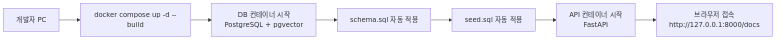
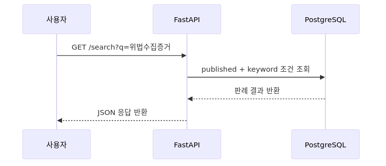
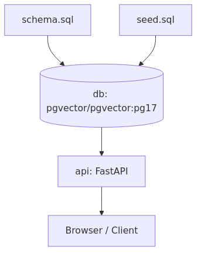

# AI_SYS 동작 실행 가이드 (초보자용)

작성일: 2026-04-08
최종 업데이트: 2026-05-11
문서 버전: v1.2

> **2026-05-11 업데이트**: iOS 앱이 완전 온디바이스(Backend-free)로 동작합니다. 아래 Docker Compose 절차는 *백엔드 옵션*을 사용할 때만 필요하며, iOS 앱만 단독 실행할 경우 Xcode 빌드+실기기 설치만으로 모든 기능이 동작합니다(검색·OCR·요약·OX·복습 노트 모두 단말 내부 처리).

이 문서는 AI_SYS를 실제로 실행하는 방법과 내부 동작 과정을 쉽게 설명한다.
가장 쉬운 방법은 Docker Compose 실행 방식이다.

## 1. 한눈에 보는 실행 순서



## 2. 실행 전에 준비할 것

- Docker Desktop이 설치되어 있어야 한다.
- Docker Engine이 실행 중이어야 한다.
- 프로젝트 루트 경로로 이동해야 한다.

프로젝트 루트 예시:
- /Users/acertainromance401/Desktop/AI_SYS/AI_SYS_TEAM

## 3. 가장 쉬운 실행 방법 (권장)

### 3.1 실행 명령

```bash
cd /Users/acertainromance401/Desktop/AI_SYS/AI_SYS_TEAM
docker compose up -d --build
```

### 3.2 정상 기동 확인

```bash
docker compose ps
```

정상이라면 다음과 비슷하게 보인다.
- aisys-db: healthy
- aisys-api: up

### 3.3 브라우저 확인

- API 문서: http://127.0.0.1:8000/docs
- Health 체크: http://127.0.0.1:8000/health

## 4. 동작 과정 설명 (이미지)

### 4.1 사용자 요청 처리 흐름



### 4.2 컨테이너 의존 관계



## 5. 실제 테스트 명령

```bash
# 1) Health
curl -sS http://127.0.0.1:8000/health

# 2) 사건번호 조회
curl -sS http://127.0.0.1:8000/cases/2019도12345

# 3) 키워드 검색 (한글은 URL 인코딩 자동 처리)
curl -sS --get --data-urlencode "q=위법수집증거" "http://127.0.0.1:8000/search"
```

## 6. 중지/재시작/초기화

```bash
# 중지
docker compose down

# 재시작
docker compose up -d

# DB 데이터까지 완전 초기화 (주의)
docker compose down -v
```

설명:
- down: 컨테이너/네트워크만 내린다.
- down -v: 볼륨까지 삭제하므로 DB 데이터가 초기화된다.

## 7. 자주 발생하는 문제와 해결

### 7.1 포트 충돌 (8000 또는 5432)
증상:
- compose 실행 시 port is already allocated 에러

해결:
- 기존 프로세스/컨테이너를 종료 후 재실행

```bash
docker compose down
```

### 7.2 DB 초기화가 다시 안 되는 경우
원인:
- schema.sql은 DB 볼륨이 "처음" 생성될 때만 자동 실행

해결:

```bash
docker compose down -v
docker compose up -d --build
```

### 7.3 API는 켜졌는데 조회 결과가 없을 때
확인:
- DB가 healthy인지 확인
- 운영 데이터가 적재됐는지 확인

```bash
docker compose ps
docker compose logs db
```

## 8. 관련 파일 위치

- 실행 정의: docker-compose.yml
- API 이미지 빌드: code/backend/Dockerfile
- DB 스키마: code/db/schema.sql
- 백엔드 실행 가이드: code/backend/README.md

## 9. 요약

- 처음 실행: docker compose up -d --build
- 확인: http://127.0.0.1:8000/docs
- 데이터 초기화 필요 시: docker compose down -v 후 다시 up

## 10. 최신 점검 결과 (2026-05-07)

- 백엔드: `docker compose up -d --build` 후 `/health` 200 확인
- 도커 구성: `docker compose config` 유효성 통과
- iOS: 빌드 가능, 단위 테스트 2건 실패(`AISYSAppTests`)로 운영 배포 전 테스트 정비 필요
